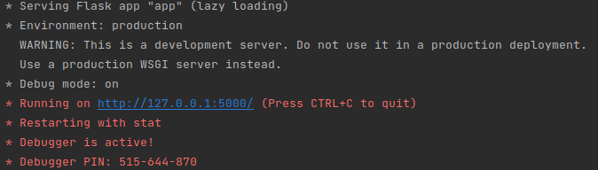

  
# Diozik

### _Bienvenue sur Diozik._
Diozik est un service de streaming numérique qui propose de la musique, des podcasts...

Les fonctionnalités sont les suivantes :
- écouter de la musique
- mettre des musiques en ligne
- consulter les profils d'utilisateurs, intéragir, rechercher

## Démarrer l'application

**Il y a plusieurs manières de procéder afin d'accéder à l'application.**

- Premièrement, on peut naviguer sur celle-ci via le lien suivant ramenant au site héberger à l'aide de Heroku :

    **ICI** (https://diozik.herokuapp.com)

- Deuxièmement, pour démarrer l'application via le code source, voici la procédure :
   - Téléchargez l'archive du projet (Project.rar)
   - Extraire l'archive
   - Ouvrir le dossier dans un interpreteur
   - Run le fichier "app.py"
   - Au lancement sera afficher ceci :
  
  
   
   - Cliquez sur le lien, et l'application sera localement en marche sur votre machine

## Problèmes rencontrés

Avant tout, nous avons tenu à développer le site sur la base du barême demandé. Tout les points on étés respéctés, sauf que, le parcours d'abre était difficile à intégrer à notre projet car on ne voyait pas ou il pouvais avoir une utilité dans l'application. Nous avons donc décider de ne pas l'intégrer et de faire un parcours d'abre à coté, fonctionnelle, mais qui n'est pas utile pour l'application. Dans un second temps, nous avons développer le site de manière à ce qu'il soit responsive au plus possible. Seulement, faute de temps, de nombreuses pages rencontres des bugs au format téléphone / tablette car le responsive n'a pas été totalement abouti.

### Erreurs non-résolus mais vu
